# Dependency Graph

## Mermaid Dependency Diagram

```mermaid
graph TD
    subgraph "Entry Point"
        S[server.js]
    end
    
    subgraph "Config"
        DB[config/db.js]
        CLOUD[config/cloudinary.js]
        RZP[config/razorpay.js]
        EB[config/easebuzz.js]
        PP[config/phonepe.js]
    end
    
    subgraph "Models"
        U[models/User.js]
        SH[models/Shop.js]
        MI[models/MenuItem.js]
        O[models/Order.js]
    end
    
    subgraph "Middleware"
        AUTH[middleware/auth.js]
        RDB[middleware/requireDb.js]
        UPL[middleware/upload.js]
    end
    
    subgraph "Routes"
        RA[routes/auth.js]
        RS[routes/shops.js]
        RC[routes/cart.js]
        RM[routes/menu.js]
        RO[routes/orders.js]
        RV[routes/vendor.js]
        RA_m[routes/admin.js]
        RW[routes/webhooks.js]
    end
    
    subgraph "Utils"
        UA[utils/admin.js]
        UE[utils/email.js]
        UO[utils/otp.js]
        UT[utils/time.js]
    end
    
    subgraph "Socket"
        SK[socket/index.js]
    end
    
    subgraph "Menu Import"
        MI_UPL[menu-import/upload.js]
        MI_IMP[menu-import/importer.js]
        MI_ST[menu-import/store.js]
        MI_V[menu-import/vision.js]
        MI_VAL[menu-import/validator.js]
        MI_PRE[menu-import/preview.js]
        MI_SP[menu-import/splitter.js]
        MI_JSON[menu-import/json-recovery.js]
        MI_DBG[menu-import/debug.js]
    end
    
    subgraph "External"
        EXT_MONGO[MongoDB]
        EXT_CLOUD[Cloudinary]
        EXT_RZP[Razorpay]
        EXT_EB[Easebuzz]
        EXT_PP[PhonePe]
        EXT_GEMINI[Gemini API]
        EXT_RESEND[Resend]
    end

    %% Server imports
    S --> DB
    S --> SH
    S --> AUTH
    S --> RA
    S --> RS
    S --> RC
    S --> RO
    S --> RW
    S --> RV
    S --> RM
    S --> RA_m
    S --> UT
    S --> SK
    
    %% Route imports
    RA --> U
    RA --> RDB
    RA --> UE
    
    RS --> SH
    RS --> MI
    RS --> RDB
    
    RC --> MI
    RC --> SH
    RC --> RDB
    RC --> AUTH
    
    RM --> MI
    RM --> RDB
    RM --> AUTH
    
    RO --> MI
    RO --> SH
    RO --> O
    RO --> RDB
    RO --> AUTH
    RO --> UO
    RO --> RZP
    RO --> EB
    RO --> PP
    RO --> SK
    
    RV --> O
    RV --> MI
    RV --> SH
    RV --> RDB
    RV --> AUTH
    RV --> UPL
    RV --> RZP
    RV --> PP
    RV --> UT
    RV --> SK
    
    RW --> O
    RW --> SH
    RW --> RDB
    RW --> RZP
    RW --> SK
    
    RA_m --> O
    RA_m --> U
    RA_m --> SH
    RA_m --> MI
    RA_m --> RDB
    RA_m --> AUTH
    RA_m --> UPL
    RA_m --> MI_UPL
    RA_m --> MI_IMP
    RA_m --> MI_ST
    RA_m --> MI_V
    RA_m --> RV --> isGatewayConfigured
    RA_m --> UA
    
    %% Middleware imports
    AUTH --> U
    AUTH --> SH
    UPL --> CLOUD
    RDB --> mongoose
    
    %% Config → external
    DB --> EXT_MONGO
    CLOUD --> EXT_CLOUD
    RZP --> EXT_RZP
    EB --> EXT_EB
    PP --> EXT_PP
    
    %% Menu Import dependencies
    MI_IMP --> MI_ST
    MI_IMP --> MI_V
    MI_IMP --> MI_VAL
    MI_IMP --> MI_PRE
    MI_V --> MI_JSON
    MI_V --> EXT_GEMINI
    
    %% Utils
    UE --> EXT_RESEND
    
    %% Socket
    SK --> O
    
    %% Cross-route
    RA_m -.->|imports isGatewayConfigured from| RV
```

## Module Dependency Table

| Module | Imports From |
|--------|-------------|
| server.js | config/db, models/Shop, middleware/auth, routes/*, utils/time, socket/index |
| routes/auth.js | models/User, middleware/requireDb, utils/email |
| routes/shops.js | models/Shop, models/MenuItem, middleware/requireDb |
| routes/cart.js | models/MenuItem, models/Shop, middleware/auth |
| routes/menu.js | models/MenuItem, middleware/auth |
| routes/orders.js | models/MenuItem, Shop, Order, middleware/auth, utils/otp, config/razorpay/easebuzz/phonepe, socket/index |
| routes/vendor.js | models/Order, MenuItem, Shop, middleware/auth, middleware/upload, config/razorpay/phonepe, utils/time, socket/index |
| routes/admin.js | models/Order, User, Shop, MenuItem, middleware/auth/upload, menu-import/*, routes/vendor, utils/admin |
| routes/webhooks.js | models/Order, Shop, middleware/requireDb, config/razorpay, socket/index |
| socket/index.js | models/Order |

## External Service Dependencies

| Service | Used By | Purpose |
|---------|---------|---------|
| MongoDB | config/db.js | Database |
| Cloudinary | config/cloudinary.js, middleware/upload.js | Image CDN |
| Razorpay | config/razorpay.js, routes/orders.js, routes/vendor.js, routes/webhooks.js | Payment processing |
| Easebuzz | config/easebuzz.js, routes/orders.js | Payment processing |
| PhonePe | config/phonepe.js, routes/orders.js, routes/vendor.js | Payment processing |
| Gemini API | menu-import/vision.js | AI menu extraction |
| Resend | utils/email.js | Transactional emails |

## NPM Dependencies

| Package | Version | Purpose |
|---------|---------|---------|
| express | ^5.2.1 | Web framework |
| mongoose | ^8.14.2 | MongoDB ODM |
| ejs | ^5.0.2 | Template engine |
| socket.io | ^4.8.3 | Real-time |
| bcryptjs | ^3.0.2 | Password hashing |
| cloudinary | ^1.41.3 | Image CDN SDK |
| multer | ^2.1.1 | File upload parsing |
| multer-storage-cloudinary | ^4.0.0 | Cloudinary upload adapter |
| razorpay | ^2.9.6 | Razorpay SDK |
| resend | ^6.17.1 | Email SDK |
| sharp | ^0.32.6 | Image processing |
| helmet | ^8.2.0 | Security headers |
| express-rate-limit | ^8.5.2 | Rate limiting |
| express-session | ^1.18.1 | Session management |
| connect-flash | ^0.1.1 | Flash messages |
| dotenv | ^16.5.0 | Environment variables |
