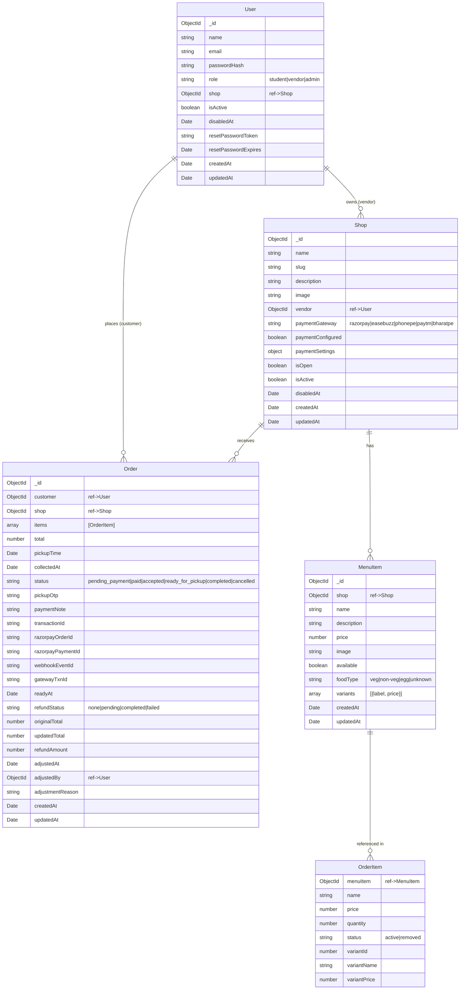

# Model Map

## Relationship Diagram

## Model Details

### User
- **Collection:** users
- **Indexes:** email (unique)
- **Relationships:**
  - `shop` → Shop (optional, vendor only)
  - Referenced by Order.customer

### Shop
- **Collection:** shops
- **Indexes:** slug (unique)
- **Relationships:**
  - `vendor` → User (optional)
  - Referenced by MenuItem.shop, Order.shop

### MenuItem
- **Collection:** menuitems
- **Indexes:** { shop: 1, name: 1 }
- **Relationships:**
  - `shop` → Shop (required)
  - Referenced by Order.items[].menuItem

### Order
- **Collection:** orders
- **Indexes:**
  - { shop: 1, pickupOtp: 1 }
  - { shop: 1, status: 1 }
  - { customer: 1, createdAt: -1 }
  - { shop: 1, pickupTime: 1, createdAt: 1 }
  - { razorpayOrderId: 1 } (unique, sparse)
  - { gatewayTxnId: 1 } (unique, sparse)
- **Relationships:**
  - `customer` → User (required)
  - `shop` → Shop (required)
  - `adjustedBy` → User (optional)
  - `items[].menuItem` → MenuItem (optional reference)

## Embedded vs Referenced

| Document | Subdocs | References |
|----------|---------|------------|
| User | - | Shop (optional) |
| Shop | paymentSettings (embedded) | User (vendor) |
| MenuItem | variants (embedded array) | Shop |
| Order | items (embedded array) | User (customer), Shop, User (adjustedBy), MenuItem (items[].menuItem) |
